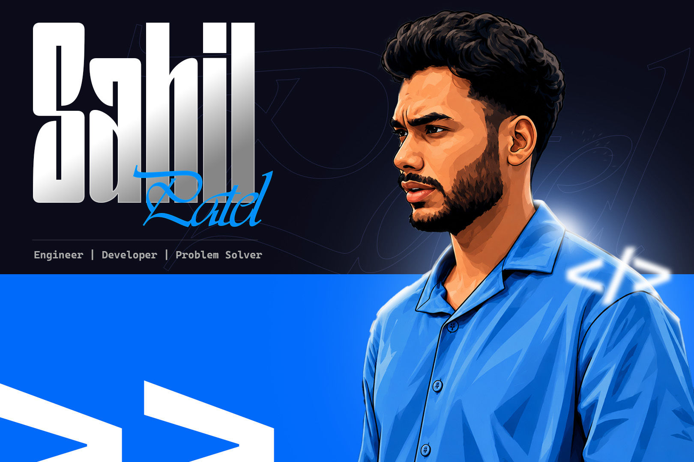

<h2 align="center">Hi there 👋, I'm Sahil Patel</h2>

🚀 Full Stack Software Engineer with 4+ years of professional experience building scalable, high-performance web applications and backend services.

My primary expertise lies in JavaScript/TypeScript ecosystems, where I design and develop modern applications using Angular, Node.js, NestJS, MongoDB, and SQL Server. I enjoy solving complex engineering challenges, optimizing system performance, and building reliable distributed systems.

Recently, I've been expanding my knowledge in Artificial Intelligence, exploring LLMs, AI-powered applications, agentic workflows, and modern AI development tools.
###
###

  
  
  

‍💻 GitHub Profiles

- Personal GitHub:  
- Work GitHub:  
###

###

  

###

  
  
  
  
  
  
  
  
  
  
  
  
  
  
  
  
  
  
  
  
  
  
  
  
  
  
  
  
  
  
  
  
  

###
